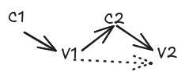
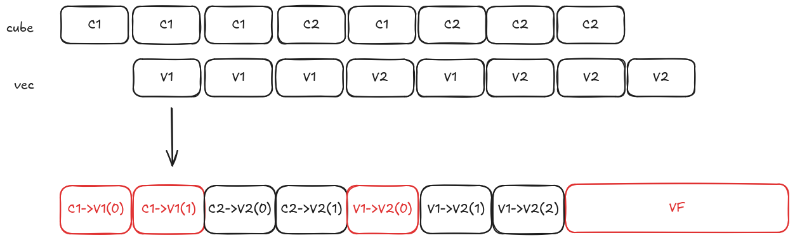
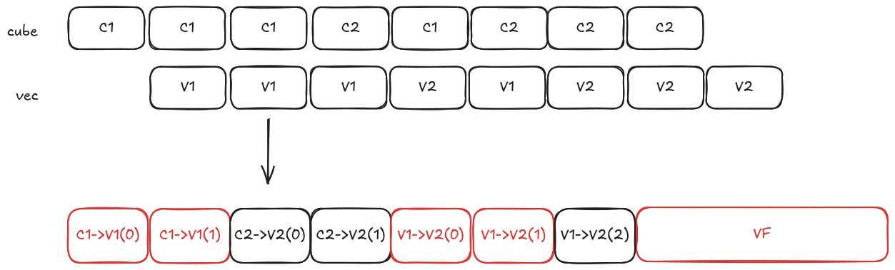
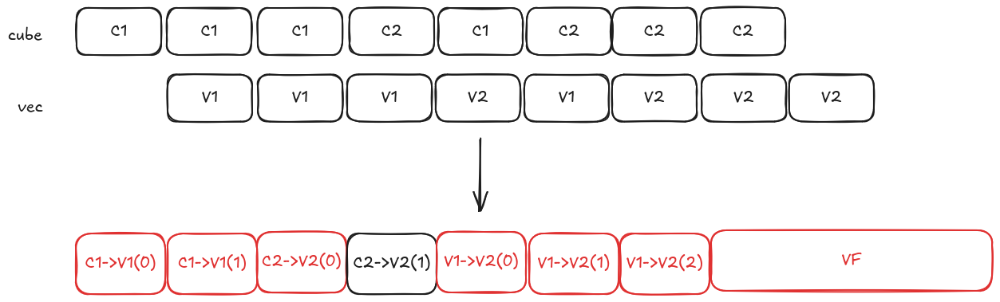
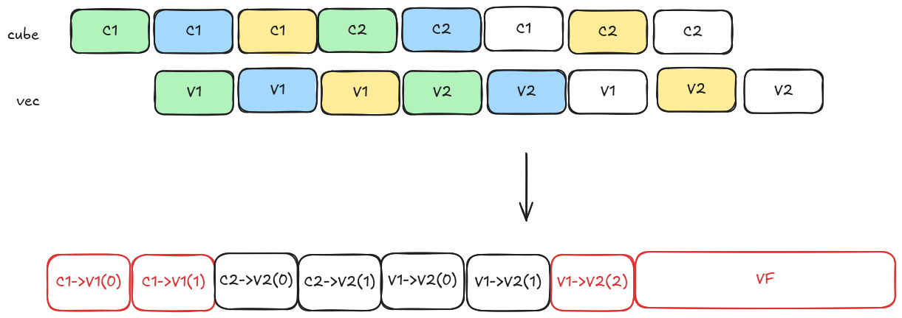
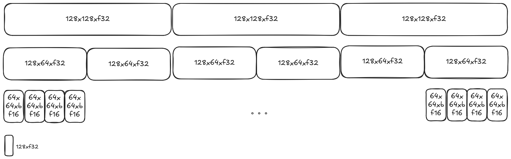

# 1. 概述
## 1.1 简介
昇腾卡当前是AIC/AIV分离架构，AIC只负责处理cube计算，AIV负责VEC计算；AIC/AIV各自使用自己的片上缓存；AIC涉及到L1、L0A/L0B、L0C、BT、FB；AIV涉及到UB内存；

由于AIC计算过程中，涉及到的片上内存是pipeline组织的（输入和输出在不同的片上内存），同时在AICORE上进行计算的过程中，需要计算的tile的shape是确定的，因此只需要对各自的片上内存进行简单的多buffer管理即可；

然而，AIV在计算过程中，并不是单纯的pipeline方式组织的；VF在运行过程中会产生输入内存和输出内存，这些内存在统一的UB上，因此需要更复杂的管理方式来完成对UB内存的复用逻辑；

## 1.2 动机
AIV的UB内存站在VF的角度来说，分为input内存、output内存、临时内存；

input内存来源：1）从GM过来的内存；2）从L0C传过来的数据；3）UB到UB的内存（前一个VF的计算结果作为当前VF的输入）；
output内存来源：1）从UB内存写回GM；2）从UB内存写回L1；3）UB到UB的内存（当前VF的计算结果作为下一个VF的输入）；
临时内存：生命周期伴随着VF存在，VF开始执行前要申请好，VF执行结束后释放；（VF拆分，融合会影响临时内存的大小）

额外需要考虑的：BANK 冲突问题；DEBUG（优先级低）

### 1.2.1当前方案
核心思想：先标记需求->规划分配->检测溢出->fallback重试；UB分配涉及三个核心阶段：pre-bufferization（tensor语义）、bufferization（tensor->memref）、post-bufferization（memref语义，UB内存分配）；

planmemory方案补充：
xxx

存在的问题：
1）可能不执行的场景也需要分配UB内存；-> UB不够的情况下，会产生内存复用，从而导致插入额外的核内同步；
2）流水排布相对固化，如下图所示：

以FA（vec上没有load为例）：

当前流水：

比较理想流水（性能+UB优化）：

总结preload的意义：为后续固定排流水的模式提前准备数据；

**突然想到的点**：N-preload类似的方式 和 不同的tiling 进行tune本是是不是也是一种优化方向？？？

### 1.2.2 未来方案
核心思想：在运行态解决UB分配问题；
涉及的问题：
1）如何通过简单操作来完成内存分配？
可行方案：（多bitmap），假设前提：需要分配的内存都是以32B为粒度的；

还是以FA为例，V1上需要Load 128xf32的数据；C1->V1需要传递的核间的数据为 128x128xf32；C2->V2需要传递的核间的数据为 128x64xf32；V2需要存出去的核间数据为 64x64xbf16的数据；

如果V1和V2需要占用的临时内存最大为48KB；那么给MTE多buffer、核间多buffer、核内多buffer 可用的内存空间就是 200KB；

128xf32 = 512B，需要400个bitmap；

128x128xf32 = 64KB，需要3个bitmap

128x64xf32 = 32KB，需要6个bitmap

64x64xbf16 = 8KB，需要24个bitmap

bitmap可以考虑存放在SSBUF中；CUBE在运行前需要申请UB内存；

2）如何减少cube 和 vector的scala交互？
除了 pipe_s 和 pipe_s 同步外还有其他方案吗？

3）串行场景下，该方式是否会有劣化？
无通用方案来覆盖？？？只能分场景去覆盖？？？

3）MTE2如何设计？

3）dfx如何设计？
